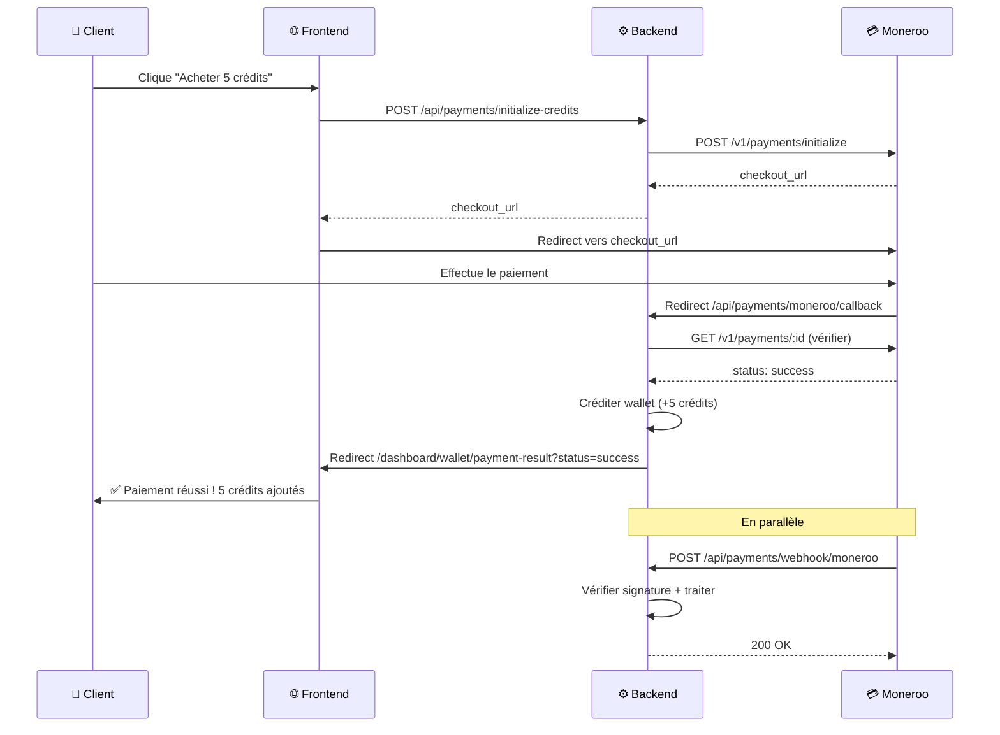

# 🚀 Moneroo - Étapes Suivantes

## ✅ Ce qui a été fait

1. ✅ **Code complet d'intégration Moneroo**
   - Initialisation de paiement
   - Callback de retour automatique
   - Webhook avec vérification de signature
   - Créditation automatique du wallet

2. ✅ **Sécurité maximale**
   - Clé API jamais exposée au frontend
   - Vérification du statut côté serveur
   - Signature HMAC-SHA256 pour les webhooks
   - Idempotence (pas de double créditation)

3. ✅ **Documentation complète**
   - Guide d'intégration complet
   - Flow détaillé
   - Tests à effectuer
   - Dépannage

---

## 🔧 Maintenant, VOUS devez configurer Railway

### Étape 1 : Ajouter les variables d'environnement

Allez sur **Railway** → Votre projet **backend** → **Variables** et ajoutez :

```env
MONEROO_API_KEY=pvk_z7d03z|01KBF6GA56TN9VM5PMFHMR932Q
```

**Important** : Railway va **redéployer automatiquement** après l'ajout de cette variable.

### Étape 2 (Optionnel) : Configurer le webhook Moneroo

Pour que les webhooks fonctionnent (backup du callback) :

1. Allez sur https://dashboard.moneroo.io
2. Connectez-vous avec vos identifiants Moneroo
3. **Développeur** → **Webhooks** → **Ajouter un webhook**
4. URL du webhook :
   ```
   https://api.annonceauto.ci/api/payments/webhook/moneroo
   ```
5. Événements :
   - ✅ `payment.success`
   - ✅ `payment.failed`
   - ✅ `payment.cancelled`
6. **Copiez le "Webhook Signing Secret"** (si disponible)
7. Retournez sur Railway et ajoutez :
   ```env
   MONEROO_WEBHOOK_SECRET=le_secret_copié
   ```

---

## 🧪 Étape 3 : Tester !

### Test 1 : Vérifier que Railway a redéployé

1. Allez sur **Railway** → **Deployments**
2. Attendez que le déploiement soit **"Active"** (cercle vert)
3. Cliquez sur **View Logs**
4. Cherchez :
   ```
   ✅ Moneroo configuré avec succès - Paiement automatique activé 🚀
   📌 API Key: pvk_z7d03z|01KB...
   ```

### Test 2 : Acheter des crédits

1. Allez sur https://www.annonceauto.ci
2. Connectez-vous avec votre compte
3. **Mon Wallet** → **Acheter des crédits**
4. Cliquez sur **"Pack Starter (5 crédits - 500 FCFA)"**
5. Vous serez redirigé vers la page de paiement Moneroo
6. **Choisissez un moyen de paiement** (Mobile Money, carte, etc.)
7. **Effectuez le paiement**
8. Vous serez redirigé vers le résultat
9. **Vérifiez que vos crédits sont bien ajoutés** dans votre wallet

### Test 3 : Vérifier les logs

Dans les logs Railway, vous devriez voir :

```
🔄 Initialisation paiement Moneroo...
✅ Paiement Moneroo créé: xxx
🔗 URL de paiement: https://checkout.moneroo.io/xxx
🔄 Callback Moneroo reçu: { monerooPaymentId: 'xxx', status: 'success' }
✅ Statut vérifié: success
✅ Paiement Moneroo réussi - 5 crédits ajoutés à votre@email.com
```

---

## 🎯 URLs importantes

| Service | URL |
|---------|-----|
| **Dashboard Moneroo** | https://dashboard.moneroo.io |
| **Docs Moneroo** | https://docs.moneroo.io |
| **Railway Backend** | https://railway.app/project/... |
| **API Backend** | https://api.annonceauto.ci/api |
| **Site Frontend** | https://www.annonceauto.ci |

---

## 🔍 Flow complet résumé



---

## 📝 Checklist finale

- [ ] Variable `MONEROO_API_KEY` ajoutée sur Railway
- [ ] Railway a redéployé automatiquement
- [ ] Logs Railway montrent "✅ Moneroo configuré avec succès"
- [ ] Test d'achat de 5 crédits réussi
- [ ] Crédits bien ajoutés au wallet
- [ ] (Optionnel) Webhook configuré sur dashboard Moneroo
- [ ] (Optionnel) Variable `MONEROO_WEBHOOK_SECRET` ajoutée

---

## 🆘 Besoin d'aide ?

### ❌ "Le système de paiement automatique n'est pas configuré"
→ Vous avez oublié d'ajouter `MONEROO_API_KEY` sur Railway

### ❌ Erreur lors de l'initialisation du paiement
→ Regardez les logs Railway pour voir l'erreur exacte de Moneroo
→ Vérifiez que la clé API est correcte

### ❌ Les crédits ne sont pas ajoutés
→ Vérifiez les logs Railway pour voir si le callback a bien été reçu
→ Vérifiez que l'URL `BACKEND_URL` est correcte dans Railway

### ❌ "Achat introuvable" lors du callback
→ La base de données n'a pas enregistré la transaction
→ Vérifiez les logs au moment de l'initialisation

---

## 🎉 Prochaines étapes (après validation)

1. **Tester avec un vrai paiement** (pas en mode test)
2. **Configurer les webhooks** pour la redondance
3. **Surveiller les logs** pour détecter les erreurs
4. **Ajouter d'autres packs** de crédits si nécessaire

---

**🚀 Tout est prêt ! Il ne reste plus qu'à ajouter la variable sur Railway et tester !**

